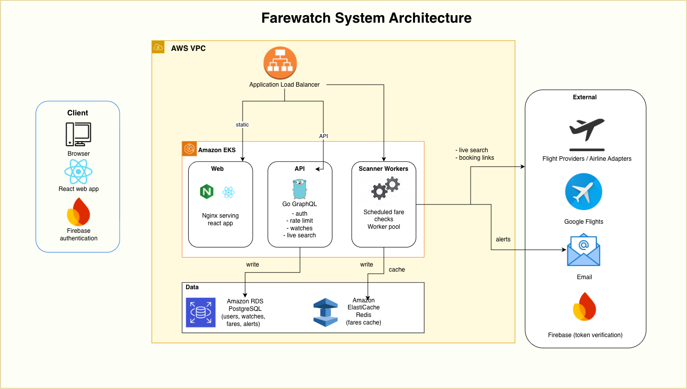

# FareWatch

## Overview

FareWatch is a flight price tracker. Search a route, watch a fare, and get an email when the price drops.

The React UI talks to a Go GraphQL API. A rate-limited worker pool polls airline adapters and optional search providers, caches recent quotes in Redis, and stores price history in PostgreSQL. Locally everything runs via Docker Compose. Production can sit on AWS (EKS, RDS, ElastiCache, ALB) with a Kubernetes CronJob for scheduled scans.

## Tech Stack

| Group | Skills |
|------|--------|
| Languages |       |
| Frameworks & Libraries |      |
| Databases & Cloud |     |
| Tools & DevOps |       |

## System Architecture



## Run locally

**Requires:** [Docker Desktop](https://www.docker.com/products/docker-desktop/)

1. Copy env and start the stack:

```bash
cp .env.example .env
make up
```

2. Open the app:

| Service | URL |
|---------|-----|
| App | http://localhost:3000 |
| GraphQL | http://localhost:8080/graphql |

3. Useful commands:

```bash
make logs   # follow api + web
make scan   # one scanner pass
make down   # stop stack
```

Optional keys in `.env` (Ignav, Travelpayouts, RapidAPI, Firebase, SMTP) unlock live providers, Google sign-in, and email alerts. Without them the stack still runs with simulator fallbacks.

### Google sign-in (optional)

Set `FIREBASE_PROJECT_ID` and `VITE_FIREBASE_*` in `.env`, enable the Google provider in Firebase Console, then:

```bash
make firebase-env   # or edit .env by hand
make up
```

### Dev without rebuilding images

```bash
docker-compose up -d postgres redis
cd backend && go run ./cmd/api
cd frontend && npm install && npm run dev
```

## Layout

```
backend/cmd/api            GraphQL server
backend/cmd/scanner        one-shot scanner (CronJob entrypoint)
backend/internal/airlines  airline + search providers
backend/internal/worker    rate-limited pool
backend/internal/cache     Redis
backend/internal/store     Postgres
frontend/                  React UI (Nginx in production image)
deploy/k8s/                Kubernetes manifests
deploy/terraform/          AWS (EKS, RDS, ElastiCache, ECR)
```

## AWS deploy (optional)

Uses CLI profile `farewatch`. Tear down when finished to stop billing.

```bash
./deploy/scripts/setup-aws-profile.sh   # once
export AWS_PROFILE=farewatch
./deploy/scripts/up.sh
./deploy/scripts/down.sh
```

See `.env.example` for config. MIT licensed - see [LICENSE](LICENSE).
